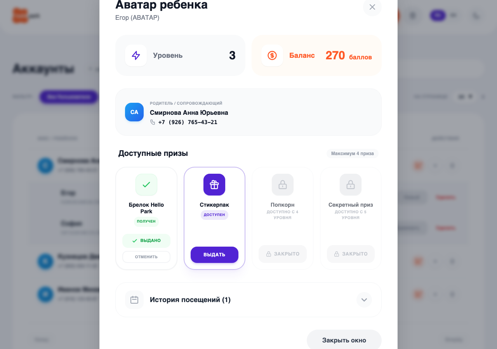

# Документация: Контакты родителя на карточке аватара

В интерфейс модального окна **«Аватар ребенка»** добавлено отображение контактных данных родителя или сопровождающего взрослого, чтобы кассир мог оперативно связаться с ним при выдаче призов или проверке RFID-браслета.

## Что добавилось в интерфейс

1. **Bento-виджет контактов (Variant 3)**:
   * Расположен в центральной части карточки, между верхними метриками (Уровень, Баланс) и разделом «Доступные призы».
   * Стилизован под Bento-блок с мягким серым фоном `bg-gray-50 dark:bg-gray-700/30` и скругленными углами `rounded-[28px]`.
   
2. **Аватар-иконка родителя**:
   * Размещен синий градиентный круг с инициалами родителя (например, **СА** для *Смирновой Анны*), вычисляемыми автоматически по ФИО.

3. **Текстовые поля**:
   * Надпись-заголовок: `Родитель / Сопровождающий` (мультиязычная поддержка).
   * Полное ФИО родителя (например, `Смирнова Анна Юрьевна`).
   * Номер телефона родителя с иконкой трубки (например, `+7 (926) 765-43-21`).

4. **Логика поиска и автозаполнения**:
   * При открытии карточки по кнопке «Детали» система автоматически ищет родителя в глобальном реестре аккаунтов, сопоставляя имя ребенка.
   * Если родитель найден, его данные (инициалы, ФИО, телефон) динамически подставляются в Bento-блок.

---

## Скриншот интерфейса

